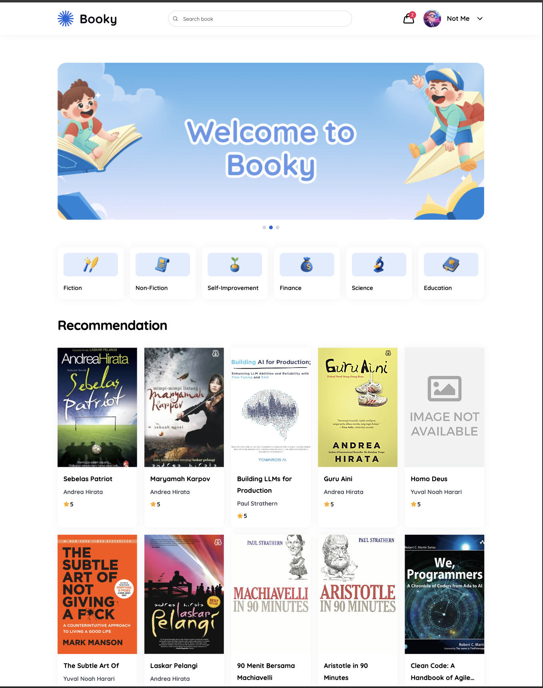
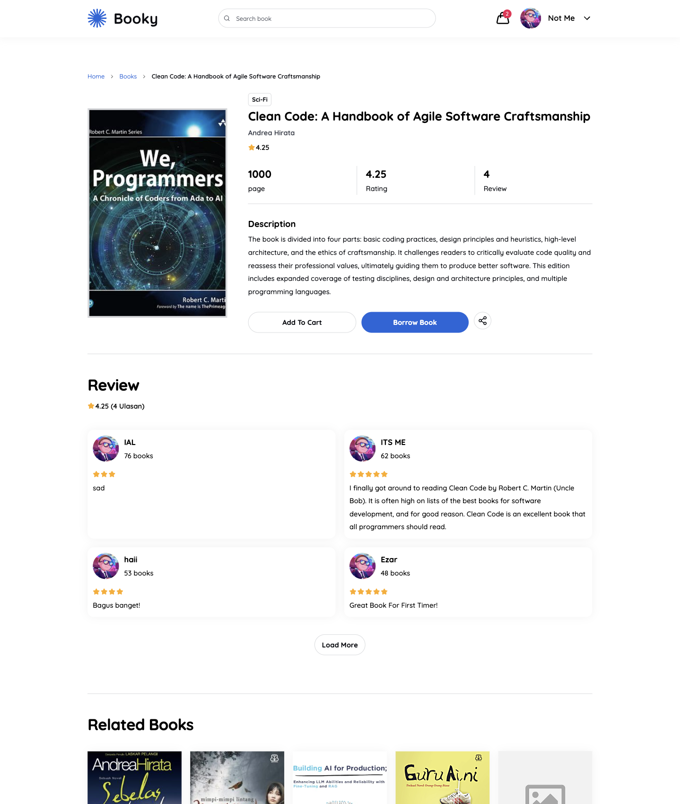
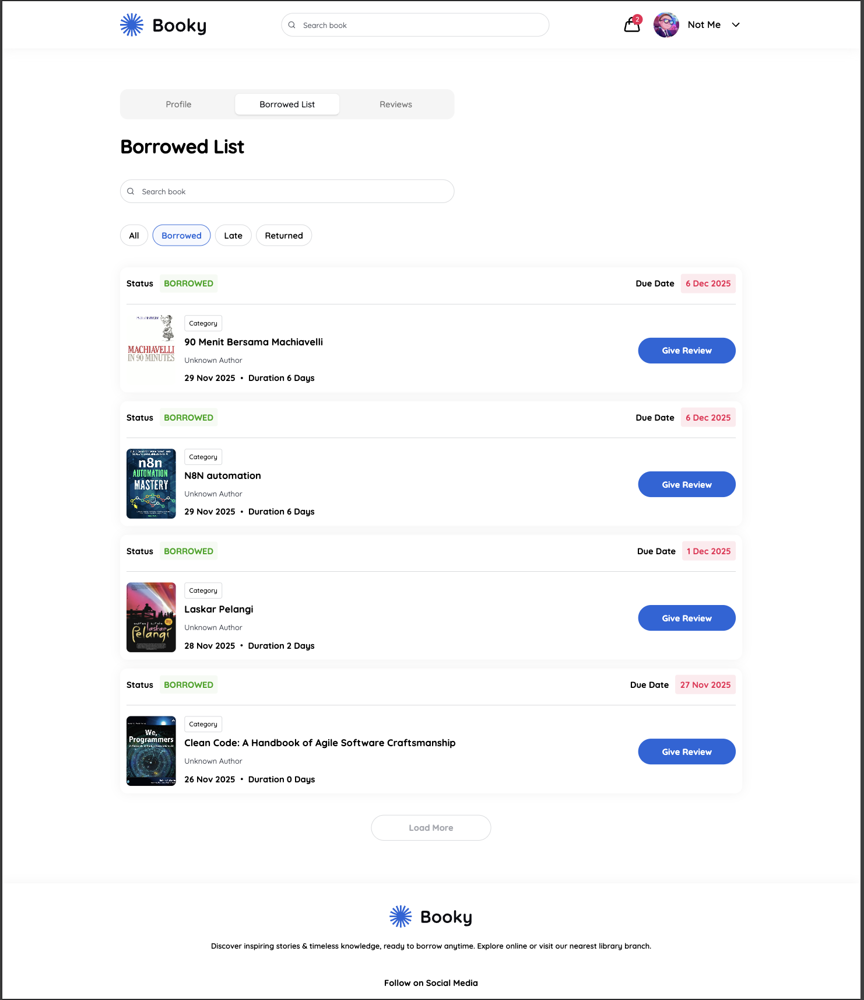
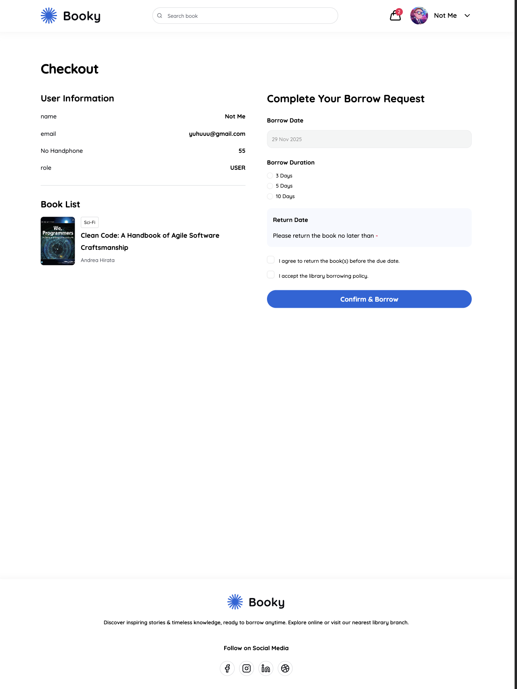
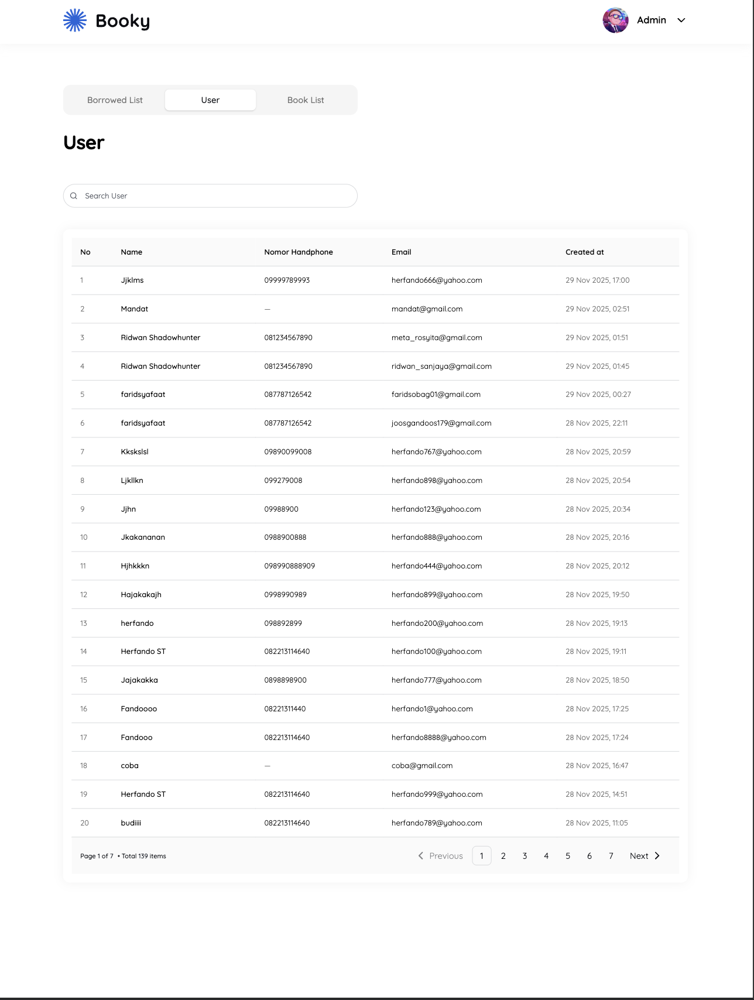
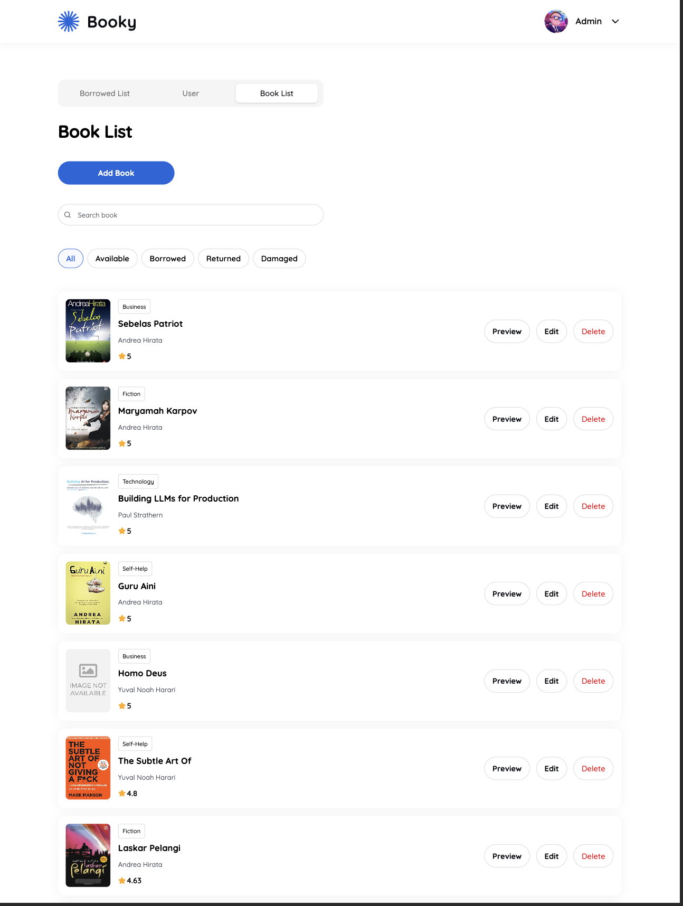
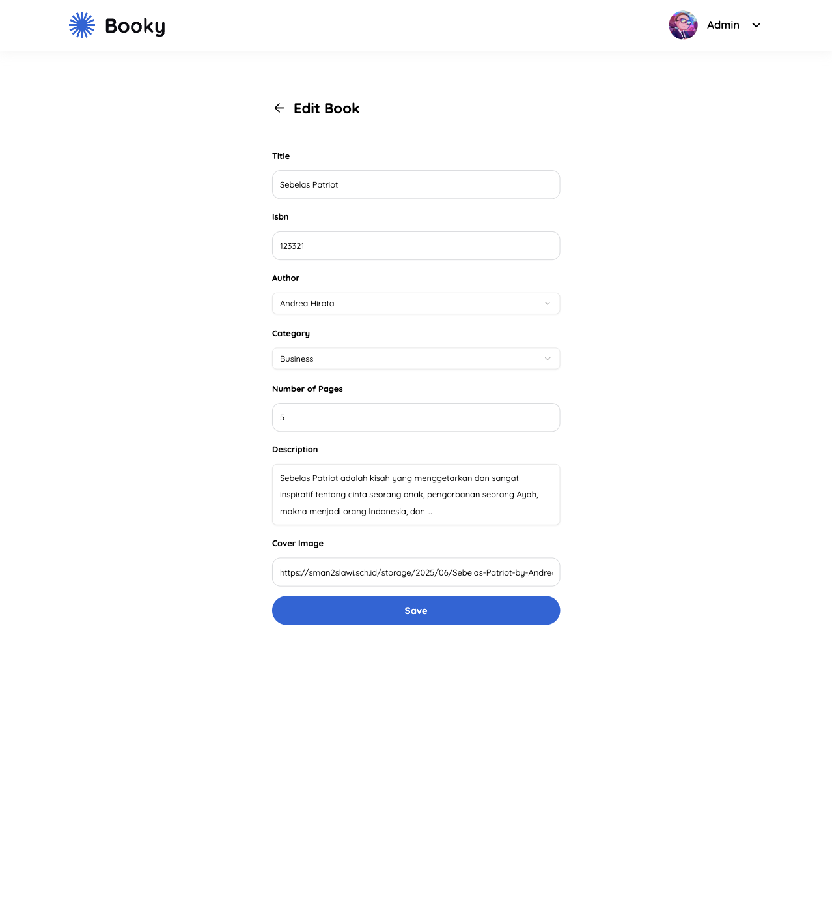
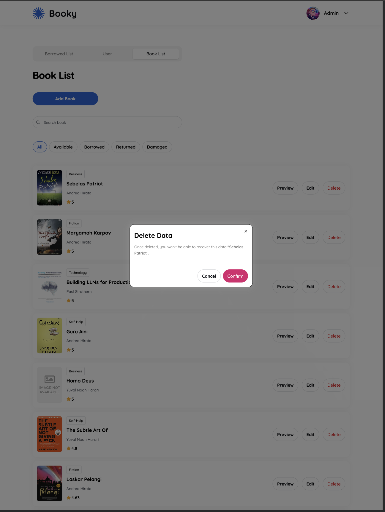
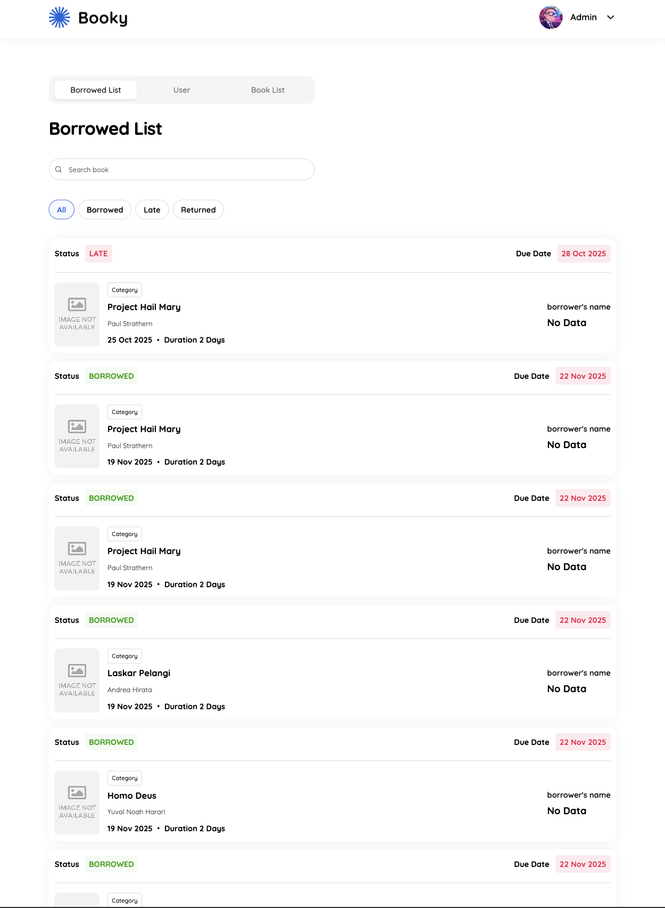

# 📚 Library App

> A modern, full-featured library management system built with React, TypeScript, and cutting-edge web technologies.

[](https://reactjs.org/)
[](https://www.typescriptlang.org/)
[](https://tailwindcss.com/)
[](https://redux-toolkit.js.org/)
[](https://tanstack.com/query)
[](https://reactrouter.com/)
[](https://vitejs.dev/)
[](https://axios-http.com/)
[](https://www.framer.com/motion/)
[](https://react-hook-form.com/)
[](https://zod.dev/)
[](https://ui.shadcn.com/)

## ✨ Features

### 🎯 Core Functionality

- **📖 Book Management** - Browse, search, and filter books by category
- **🔐 Authentication** - Secure login and registration system
- **📝 Loan System** - Borrow books with real-time stock management
- **⭐ Reviews** - Rate and review books you've read
- **👤 User Profile** - Personal dashboard with borrowing statistics
- **🛒 Cart System** - Borrow multiple books at once
- **⚡ Optimistic UI** - Instant feedback for better user experience
- **👨‍💼 Admin Panel** - Complete administrative controls

### 🎨 User Experience

- **Responsive Design** - Seamless experience across all devices
- **Toast Notifications** - Real-time feedback with Sonner
- **Image Carousel** - Beautiful book displays with Embla Carousel

## 🚀 Tech Stack

### Frontend Framework

- [React](https://reactjs.org/) `^19.2.0` - Latest React with improved performance
- [TypeScript](https://www.typescriptlang.org/) `~5.9.3` - Type safety and better DX
- [Vite](https://vitejs.dev/) `rolldown-vite@7.2.5` - Lightning-fast build tool

### Styling

- [Tailwind CSS](https://tailwindcss.com/) `^4.1.17` - Utility-first CSS framework
- [shadcn/ui](https://ui.shadcn.com/) - High-quality, accessible component library
- [class-variance-authority](https://cva.style/) `^0.7.1` - Dynamic component variants
- [Framer Motion](https://www.framer.com/motion/) `^12.23.24` - Advanced animations

### State Management

- [Redux Toolkit](https://redux-toolkit.js.org/) `^2.10.1` - Centralized state management
  - `authSlice` - Token and user data
  - `uiSlice` - Filters and search state
  - `cartSlice` - Shopping cart for multiple borrows
- [Redux Persist](https://github.com/rt2zz/redux-persist) `^6.0.0` - Persist state across sessions

### Data Fetching

- [TanStack Query](https://tanstack.com/query) `^5.90.10` - Powerful data synchronization
  - Server state management
  - Caching and invalidation
  - Optimistic updates
  - React Query DevTools included

### Form Management

- [React Hook Form](https://react-hook-form.com/) `^7.66.1` - Performant form handling
- [Zod](https://zod.dev/) `^4.1.12` - Schema validation
- [@hookform/resolvers](https://github.com/react-hook-form/resolvers) `^5.2.2` - Validation integration

### Routing

- [React Router DOM](https://reactrouter.com/) `^7.9.6` - Client-side routing

### HTTP Client

- [Axios](https://axios-http.com/) `^1.13.2` - Promise-based HTTP client

### UI Components & Icons

- [Radix UI](https://www.radix-ui.com/) - Unstyled, accessible components
  - Avatar, Checkbox, Dialog, Dropdown Menu, Label, Radio Group, Select, Slot, Tabs
- [Lucide React](https://lucide.dev/) `^0.554.0` - Beautiful icon library
- [Embla Carousel](https://www.embla-carousel.com/) `^8.6.0` - Smooth carousel with autoplay

### Utilities

- [Day.js](https://day.js.org/) `^1.11.19` - Lightweight date formatting
- [clsx](https://github.com/lukeed/clsx) `^2.1.1` - Conditional className utility
- [tailwind-merge](https://github.com/dcastil/tailwind-merge) `^3.4.0` - Merge Tailwind classes
- [Sonner](https://sonner.emilkowal.ski/) `^2.0.7` - Toast notifications
- [next-themes](https://github.com/pacocoursey/next-themes) `^0.4.6` - Theme management

## 📱 Pages & Features

### 🔓 Public Pages

#### Login / Register

- Secure authentication forms
- Token storage with Redux
- Form validation with Zod

#### Book List



- Browse all available books
- Category filtering
- Real-time search
- Responsive grid layout

#### Book Detail



- Comprehensive book information
- Real-time stock availability
- User reviews and ratings
- Quick borrow action

### 🔒 User Pages

#### My Loans



- Track borrowed books
- Status indicators (BORROWED/RETURNED)
- Due date tracking
- Return history

#### Cart / Checkout



- Borrow multiple books at once
- Animated cart icon
- Stock validation
- Instant feedback

#### My Profile

- Personal information management
- Borrowing statistics
- Activity history
- Profile updates

### 👨‍💼 Admin Pages

#### User Management



- User search and filtering
- User details and statistics

#### Book Management



- Add, edit, and delete books
- Stock management
- Category assignment




#### Loan Management



- Monitor all active loans
- Manage returns
- Overdue tracking

## 🏗️ Project Structure

```
library-app/
├── src/
│   ├── api/                # API client and endpoints
│   ├── app/                # Application pages
│   │   ├── auth/          # Authentication pages
│   │   │   ├── login/     # Login page
│   │   │   ├── register/  # Register page
│   │   │   ├── auth.constants.ts
│   │   │   ├── layout.tsx
│   │   │   └── type.ts
│   │   ├── dashboard/     # Dashboard page
│   │   ├── user/          # User pages
│   │   ├── App.css
│   │   ├── App.tsx
│   │   ├── layout.tsx
│   │   └── main.tsx
│   ├── assets/            # Static assets
│   │   ├── icons/         # Icon files
│   │   ├── readme/        # Documentation screenshots
│   │   ├── hero.png
│   │   └── logo.svg
│   ├── components/        # Reusable components
│   │   ├── container/     # Layout containers
│   │   ├── pages/         # Page-specific components
│   │   └── ui/            # shadcn/ui components
│   ├── constants/         # Application constants
│   ├── hooks/             # Custom React hooks
│   ├── lib/               # Utility functions
│   ├── providers/         # Context providers
│   ├── routes/            # Route definitions
│   ├── schema/            # Zod validation schemas
│   ├── service/           # API services
│   ├── store/             # Redux store and slices
│   └── type/              # TypeScript type definitions
├── public/                # Public static assets
└── package.json
```

## ⚙️ Installation & Setup

### Prerequisites

- Node.js 18+
- npm or yarn
  git

### Installation

```bash
# Clone the repository
git clone <repository-url>
cd wph-library-app

# Install dependencies
npm install

# Set up environment variables
cp .env.example .env
```

### Environment Variables

Create a `.env` file in the root directory:

```env
VITE_PUBLIC_API_URL=https://be-library-api-xh3x6c5iiq-et.a.run.app/api
```

### Available Scripts

```bash
# Development server
npm run dev

# Build for production
npm run build

# Preview production build
npm run preview

# Lint code
npm run lint
```

## 🎯 User Flow

### 1️⃣ Authentication

```
Login/Register → Store Token → Redirect to Home
```

### 2️⃣ Browse Books

```
Book List → Apply Filters/Search → View Details → Add to Cart
```

### 3️⃣ Borrow Flow

```
Cart → Review Items → Confirm Borrow → Optimistic UI Update → Success Toast
```

### 4️⃣ Review Flow

```
My Loans → Select Book → Write Review → Submit → Instant Display
```

### 5️⃣ Profile Management

```
My Profile → View Statistics → Update Info → Track Activity
```

### 6️⃣ Admin Operations

```
Admin Panel → Manage Users/Books/Loans → CRUD Operations → Real-time Updates
```

## 🎨 UI/UX Guidelines

### Design Principles

- ✅ **Consistency** - shadcn/ui components throughout
- ✅ **Responsive** - Mobile-first Tailwind layouts
- ✅ **Feedback** - Loading states, error handling, success toasts
- ✅ **Accessibility** - ARIA labels, keyboard navigation
- ✅ **Performance** - Optimistic updates, lazy loading

### State Indicators

- 🔄 **Loading** - Skeleton screens and spinners
- ✅ **Success** - Toast notifications with Sonner
- ❌ **Error** - Clear error messages and retry options
- 📅 **Dates** - Formatted with Day.js

## 🚀 Key Features Implementation

### Optimistic UI

Stock automatically decreases when borrowing, providing instant feedback before server confirmation.

### TanStack Query

- Smart caching reduces unnecessary API calls
- Automatic background refetching
- Optimistic updates for mutations
- Built-in loading and error states

### Redux Toolkit

- Centralized state management
- Token persistence across sessions
- Filter and search state
- Cart management

### Form Validation

- React Hook Form for performance
- Zod schemas for type-safe validation
- Real-time error feedback

## 🤝 Contributing

Contributions are welcome! Please follow these steps:

1. Fork the repository
2. Create a feature branch (`git checkout -b feature/amazing-feature`)
3. Commit your changes (`git commit -m 'Add amazing feature'`)
4. Push to the branch (`git push origin feature/amazing-feature`)
5. Open a Pull Request

## 📞 Support

For support, please contact the development team or open an issue in the repository.
